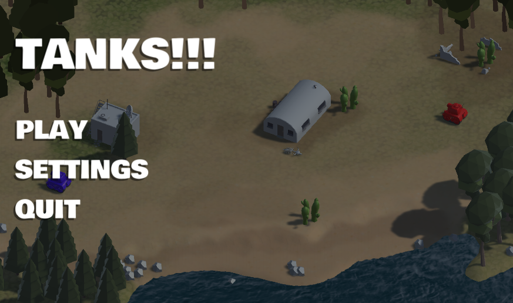
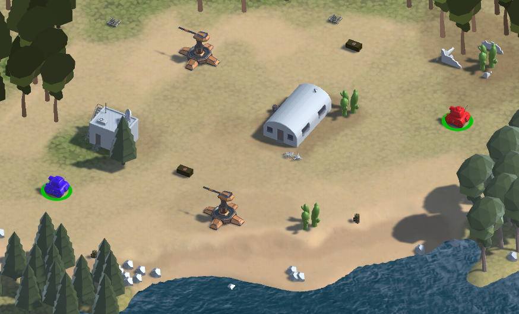
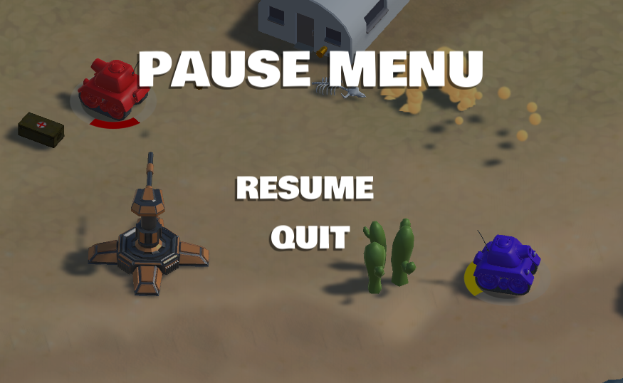
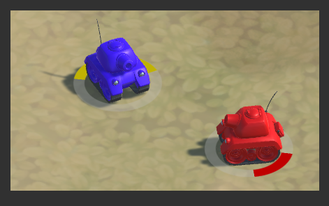
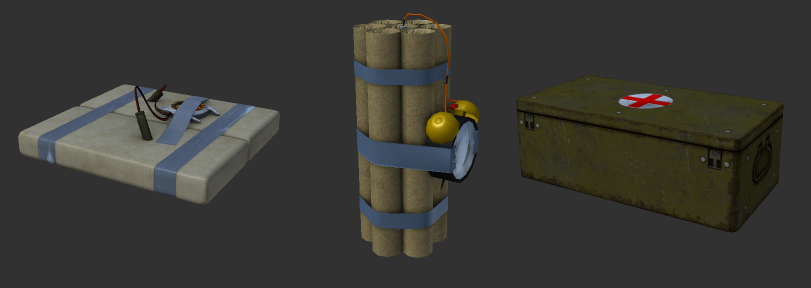
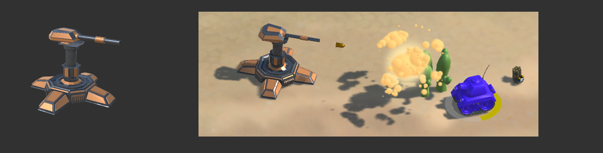

# Tank-Shooter Game

## Introduction

In this project Tank-shooter game implementation is proceeding.

At the current moment, game has been implemented only for multiplayer mode (deathmatch mode  - PvP).
To get more information about deathmatch mode click by the next link: [Deathmatch mode](https://en.wikipedia.org/wiki/Deathmatch).

Development of this game is the result of my [Unity development. Level 1](https://geekbrains.ru/courses/90) course, and [Unity Tanks Tutorial] (https://unity3d.com/ru/learn/tutorials/projects/tanks-tutorial).

## Brief information about the game

This game has only (at present) deathmatch mode for two players: player_1 (```red color```) and player_2 (```blue color```).
In the deathmatch mode one must get 5 frags to win the game (number of frags could be ranged from 3 to 10 in Settings menu).

When you double click on the game exe file (Information about how get exe file of the game you can find below in Prerequisites below) you find yourself in ```Game main menu``` (see picture below), where we have three different buttons:
* ```Play``` - click on this button to start a the new game.
* ```Settings```- pressing on this button lead you to settings menu in which you could change game settings (on development stage).
*  ```Quit``` - pressing on this button lead to the game ```Quit menu```.
 

 
Pressing ```Play``` button starts new game.

The players start the game on the opposite sides of the map (you can see red and blue tank on the picture below). 

The picture below demonstrate the initial screen in this game: on this picture we can see two tanks, buildings, and set of additional game objects, like timer bomb, medicine, and others. (More information about this objects you could find below in ```Objects``` section).

Before the beginning of each round , there will be a message on the center of the screen displays the round number and in a few seconds new raund begin.

When one of players has won the game (number of another player's deaths is equal to 5) you will get the message displaying game winner and the final scope and in a few seconds ```Post-Game menu``` starts.

In this menu there are two active buttons (at the present moment):
* ```Restart``` - press this button to restart the game.
*  ```Quit``` - pressing on this button lead to the game ```Quit menu```.



During the game process one could pres on the ```Esc``` key on the keyboard which lead to the game ```Pause menu```.

In this menu there are two active buttons:
* ```Resume``` - click on this button to resume the game (You can also click on the ```Esc``` key on the key board once again to get the same action.)
*  ```Quit``` - pressing on this button lead to the game ```Quit menu```.



The game has some additional ```Game menus```, but they are trivial and need no explanation.

### Player

In the game playing person drive a tank with appropriate color (Tank color depending on the unique number of player, for instance: 1 - blue, 2 -red).

Tank has a set of firing shells:
* ```Simple shell``` - deals 5 damage when intersect the players collider. Recharge time is equal to 0.3 sec. and shooting force is 800 N (Shooting on the low distance).
* ```Explosive shell``` -deals 10 damage to an area with affected radius is equal to 5 unity units to all players within. Recharge time is equal to 1 sec. and shooting force is 1200 H (Shooting on the big distance).

When one of the players gets damage from a shell or a bomb (for more information about bombs read section ```Objects``` below) he lose hp (At the game beginning each player has 100 hp).

To display hp pf each payer in the current moment of the game the bar indicator has been implemented. 
This is a circle under the tank displaying current hp as an appropriate part of the circle. 
Different colors used to visualise (low hp - red color, middle hp - yellow color, full hp - green color).

For example on the picture below you can see two tanks with different hp bar.



### Additional object

You can find some additional objects on the map during the game playing.

* ```Plastic bombs``` - explode immediately when player intersect the bomb collider and deals 20 hp damage (```Deals damage only to player, who activate the bomb```). Respawn time is equal to 20 sec.
* ```Timer bombs``` - explode after a certain amount of time (by default this time is equal 2 sec) and deals damage to all players in affected area with 10 unity units radius. Bomb damage is equal to 10 hp (For all players whouse possition are in affected area). Respawn time is equal to 20 sec.
* ```Medicine``` - heals player (Only player, who get up the medicine box) on 20 hp. Respawn time is equal to 30 sec. Initial position is a random between several possible points.

On the picture below you can find an illustration of plastic bomb, timer bomb and medicine box in appropriate order.



Another object in the game is a ```Turret``` with a simple AI interaction implementation.
Turret start shooting when player come in the affected area with radius is equal to 10 unity unit points and rotates towards the player while it is in the area. 
As player leave the affected area - turret movements stops.
Turret firing with ```Simple Shell``` prefabs, described above.

On the picture below you can find a turret prefab (left part of the picture) and its shooting process (right part of the picture).



## Getting Started.

To play this game, or use it as the base for your own project, first thing you need to do - is just to clone it into your local repository.

If you want to deploy this solution on your local machine for development or testing purposes you need to do next things:
* First thing, you need to do - clone or download this project.
* Open Unity platform and select ```Open project``` button and choose ```Tank-Game``` folder.

This two steps are necessary for deploying your own solution on the base of my project.
To run the game you need to do next two steps:

* Build the project by pressing Ctrl+Shift+B keyboard combination and folow the building instructions. As a result you will get exe file.
* Double click on exe file and play the game.


## Prerequisites.

To deploy or run this solution you need:
* [Visual Studio 2015] (https://www.visualstudio.com/ru/downloads/) - an integrated development environment (IDE) from Microsoft used in this pgoject.
* [Unity] (https://unity3d.com/ru/get-unity/download) - Unity is the ultimate game development platform is used to build high-quality 3D and 2D games, deploy them across mobile, desktop, VR/AR, consoles and other platforms.

## Authors.

* **Zakharov Aleksey** - *Initial work* - [PurpleBooth](https://github.com/ZakharovAleksey)

