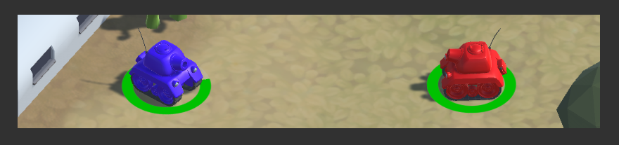

# Tank-Shooter game.

In this project Tank-shooter game implementation proceeding.

At current moment, game has been implemented only multiplayer (deathmatch mode  - PvP).
To get more information about deathmatch mode cklick on the next link [Deathmatch mode](https://en.wikipedia.org/wiki/Deathmatch).

Development of this game is the result of my [Unity development. Level 1](https://geekbrains.ru/courses/90) course, and [Unity Tanks Tutorial] (https://unity3d.com/ru/learn/tutorials/projects/tanks-tutorial).

## About game

This game has only (at present) dethmatch mode for two players: player_1 (```red color```) and player_2 (```blue color```).
In the dethmatch mode one must get 5 frags to win the game (number of frags could be ranged from 3 to 10 in Settings menu).

When you double click on the game exe file (Information about how get exe file of the game you can find below in Prerequisites below)
 you find yourself in ```Game main menu``` (see. picture below), where we have tree different buttons:
 * ```Play``` - click on this button starts the new game.
 * ```Settings```- click on this button leed you to settings menu in wich you coud change game setteings (on development stage).
 *  ```Quit``` - click on this button leed you to the game quit menu.
 

 
Choosing ```Play``` button in the main menu leed to game process execution. 

The players starts on the opposite sides of the map (you can see red and blue tank prefabs on the picture below). 
The picture below demonstrate the initial sceen in this game.

Before each round execution you will see the message on the center of the screen with round number and atfter this message game will started in a few seconds.

When one of players win the game (another player death count is equal to 5) you will get the message with game winner and in a few seconds ```Post-Game menu``` execution started. In this menu there are two buttons (at the present moment):
* ```Restart``` - click on this button restart the game.
*  ```Quit``` - click on this button leed you to the game quit menu.


During the game process one could pres on the ```Esc``` key on the keyboard wich leed to the game pause menu. 
In this menu there are two buttons:
* ```Resume``` - click on this button continue the game process (You can alsow click on the ```Esc``` key on the key board once again to get the same action.)
*  ```Quit``` - click on this button leed you to the game quit menu.


The game has some additional ```Game menus```, but they are trivial and need no explanation.

### Players

Person, playing the game drive a tank with aproppriate color depending on player number (1 - red, 2 -blue).
Tank has a set of firing shells:
* ```Simple shell``` - deals 5 damage only when intersect the players collider. Recharge time is equal to 0.3 sec. and fire force is 800 N (low distance shell).
* ```Explosive shell``` - deals 10 damage to area with affected radius is eqaual to 5 unity units to all players within.Recharge time is eaula to 1 sec. and fire force is 1200 H (big distance shell)

When one of the palyers get damaged by shell or a bomb (for more information about bombs read section ```Objects``` below) he looze hp (At the game beginig each player has 100 hp). 

Each palyer has the point bar indicator, wich display current hp using different colors (low hp - red color, middle hp - yellow color, full hp - green color).

For example on the picture below you can see two tanks with different hp bar.


### Objects

In this game implementation there are some additional objects you can find on the map.

* ```Plastic bombs``` - explode immediately when player intersect bob collider and damage him on 20 hp (Deals damage only to Player, who activate the bomb). Respawn time is equal to 20 sec.
* ```Timer bombs``` - explode after a certain amount of time (by default this time is equal 2 sec) and deals damage to all players in affected area with 10 unity units radius. Bombs damage is equal to 10 hp (For all players thouse possition are in affected area) and bomb spawn time is equal to 20 sec.
* ```Medicine``` - heals player (Only palyer, who give up the medicine box) on 20 hp. Spawns each 30 second on a random position choosen betwen several possible.

On the picture below you can find an illustartion of plastic bomb, timer bomb ans medicine box in apropriate order.


Another object in the game is the ```turrett```, for wich a simple AI interaction has been made.
Turret start shooting when player come in the affected area with radius is eqaul to 10 unity unit points and rotate towards the player shooting with ```Simple shell``` prefabs.

On the picture below you can find a turret prefab (left part of the picture) and its shooting process (right part of the picture).


## Getting Started.

To play this game, or use it as the base for your own project, first thing you need to do - is just to clone it into your local repository.

If you want to deploy this solution on your local machine for development or testing purposes you need to do next things:
* First thing, you need to do - load Unity Project. Just choose apropriate folder.
* Build the project by pressing Ctrl+Shift+B keyboard combination and folow the building instructions. As a result you will get exe file.
* Double click on exe file and enjoy playing the game.


### Prerequisites.

To deploy or run this solution you need:
* [Visual Studio 2015] (https://www.visualstudio.com/ru/downloads/) - an integrated development environment (IDE) from Microsoft used in this pgoject.
* [Unity] (https://unity3d.com/ru/get-unity/download) - Unity is the ultimate game development platform is used to build high-quality 3D and 2D games, deploy them across mobile, desktop, VR/AR, consoles and other platforms.
